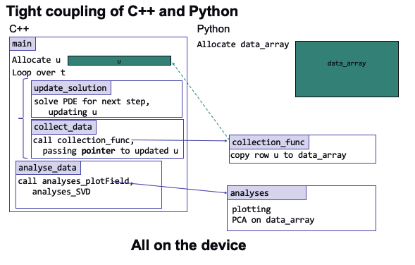

# burgerPy
A simple mini-application that calls Python frameworks within a computational physics workflow

# Description

The purpose of this mini-application is to demonstrate how one may deploy scientific machine learning within a computational physics workflow. This code represents a *practical* deployment because it satisfies the following features:
1. The computation is performed using a compiled language as is the case with most legacy codes (C++).
2. We avoid disk-IO through in-situ transfer of data from the numerical computation to the machine learning computation (in Python).
3. Enable in-situ analysis on a GPU with zero-copy (i.e. avoid transfer to the host). 

In addition, this code also highlights the advantages of integrating the Python ecosystem with C++. We now have the following capabilities:
1. Utilizing arbitrary framework for accelerators such as CuPY through their Python APIs.
2. Easy in-situ visualization in matplotlib from a CUDA/C++ computation on the device.
3. A potential interface (if there are no issues with security) to streaming data from the internet (from say, a Python API).
4. Easy ability to save data using formats like HDF5 or NetCDF4.

The test-case demonstrated here aims to capture a modal decomposition using an SVD (Singular Value Decomposition). Here is how the coupling between C++ and Python is performed:


The test-case involves the solution of the 1-D Burger's equation. The problem is solved explicitly in time using the forward Euler method.  Like most GPU-enabled solvers, the physics kernel is executed on the device where critical field data resides. This implementation makes use of the [CuPY](https://cupy.dev/) framework to perform in-situ analysis on the device, thereby, avoiding the cost of data movement to host. 

While this example demonstrates a coupling with CUDA, it is possible to integrate with other programming models or abstractions.  For example, this [link](https://github.com/argonne-lcf/sdl_workshop/tree/master/couplingSimulationML/ML_PythonC%2B%2B_Embedding/ThetaGPU_OCCA) shows how to couple the ML workflow with an application that uses a performance-portability abstraction layer, namely [OCCA](https://github.com/libocca/occa), which executes physics kernels on the device for a variety backend-specific programming models (e.g. CUDA, HIP, SYCL).

## Requirements

- CUDA compiler (e.g. nvcc) that come with CUDA Toolkit (preferably v10.2 or above)
- Python Environment (v3.7.0 or above)
- CuPY (see [installation](https://docs.cupy.dev/en/stable/install.html))

## Building and Running


## Feature

### Using CuPY to enable zero-copy, in-situ analysis
In CuPY, `cupy.ndarray` is the counterpart of the NumPy `numpy.ndarray` which provides an interface for fixed-size multi-dimensional array which resides on a CUDA device.  Low-level CUDA support in CuPY allows us to retreive device memory. For example,

```
import cupy
from cupy.cuda import memory

  def my_function(a):
      b = cupy.ndarray(
                  a.__array_interface__['shape'][0],
                  cupy.dtype(a.dtype.name),
                  cupy.cuda.MemoryPointer(cupy.cuda.UnownedMemory(
                                             a.__array_interface__['data'][0], #<---Pointer?
                                             a.size,
                                             a,
                                             0), 0),
                  strides=a.__array_interface__['strides'])

``` 
